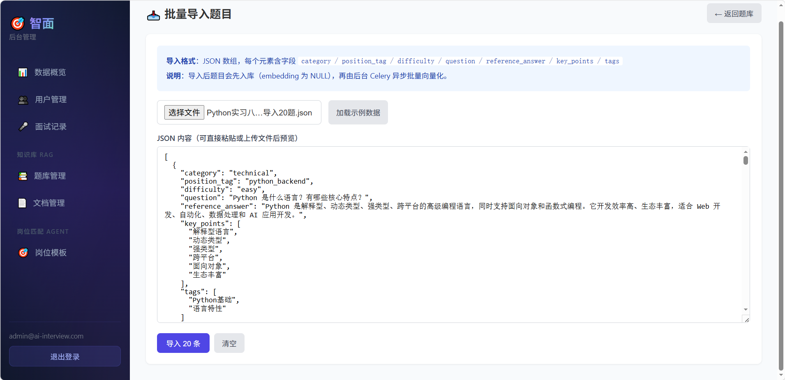
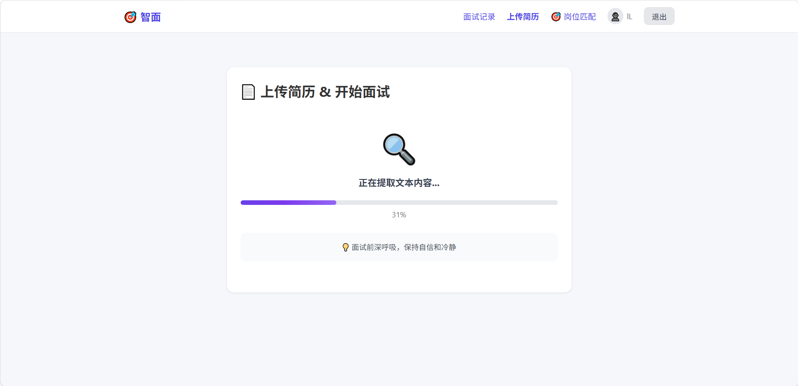
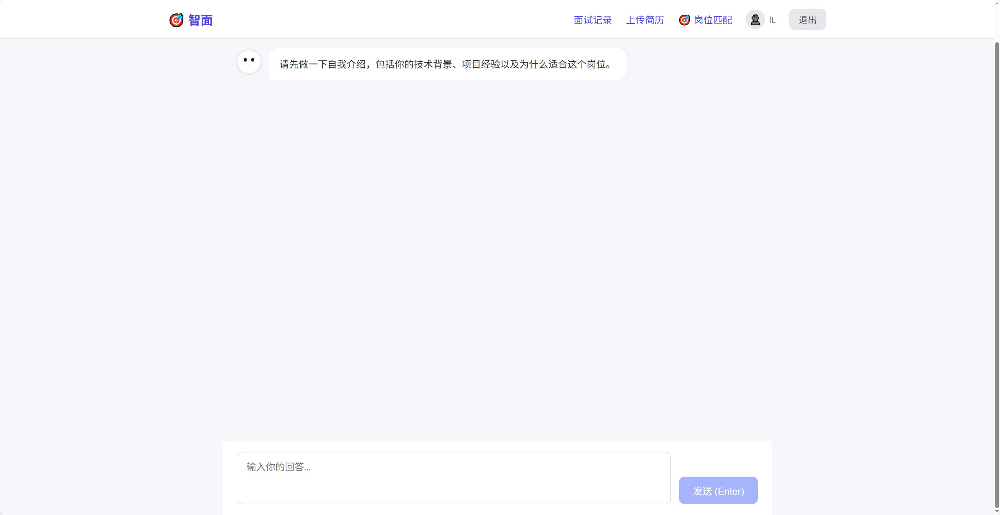

# AI Interview Agent 🤖

AI Interview Agent 是一个基于人工智能技术的智能面试辅助平台。

项目通过 AI 技术实现简历分析、岗位匹配、模拟面试、面试评估、题库管理等功能，帮助用户提升面试准备效率，同时为企业提供智能化面试管理工具。

---

## ✨ 项目功能

### 👤 用户端

- 用户注册与登录
- 个人信息管理
- 简历上传与管理
- AI 模拟面试
- 面试过程记录
- 面试报告生成
- 岗位智能匹配


### 🏢 管理后台

- 用户管理
- 面试记录管理
- 题库管理
- 知识库管理
- 岗位模板管理
- 面试数据统计


### 🤖 AI 智能能力

- 基于简历生成面试问题
- AI 面试交互
- 面试表现分析
- 智能评分与反馈
- 知识库辅助回答


---

## 📁 项目结构

```
ai-interview-agent
│
├── ai-interview-frontend
│   └── 用户端前端项目
│
├── ai-interview-admin
│   └── 管理后台项目
│
├── ai-interview-backend
│   └── 后端 API 服务
│
├── 题库和知识库文档
│   └── 面试题库及知识资料
│
└── 项目截图
    └── 系统运行截图
```


---

## 🛠️ 技术栈

### 前端

- Vue 3
- Vite
- JavaScript
- Vue Router
- Pinia
- CSS


### 后端

- Python
- FastAPI
- RESTful API
- JWT 身份认证


### 数据库及服务

- MySQL
- Redis
- Docker
- 云存储服务


---

## 🚀 项目运行


### 1. 克隆项目

```bash
git clone git@github.com:liuzr666/ai-interview-agent.git

cd ai-interview-agent
```


### 2. 启动后端

进入后端目录：

```bash
cd ai-interview-backend
```

安装依赖：

```bash
pip install -r requirements.txt
```

配置环境变量：

```
.env
```

启动服务：

```bash
python main.py
```


---

### 3. 启动用户端

```bash
cd ai-interview-frontend

npm install

npm run dev
```


---

### 4. 启动管理后台

```bash
cd ai-interview-admin

npm install

npm run dev
```


---

## 📷 项目截图

### 1. 题目导入


### 2. 简历解析


### 3. AI面试


### 4. 面试报告


---

## 📖 API 文档

后端启动后访问：

```
http://localhost:8000/docs
```

查看接口文档。


---

## 🔐 配置说明

项目运行前需要配置：

```
.env
```

包括：

- 数据库配置
- JWT 密钥
- AI 服务配置
- 文件存储配置


---

## 📦 部署方式

支持：

- Docker 部署
- Docker Compose
- Linux 服务器部署


---

## 📌 后续优化方向

- 增加更多 AI 面试模型支持
- 优化语音面试功能
- 增加实时语音交互
- 增强面试数据分析能力


---

## 📄 License

本项目仅用于学习、研究及项目展示。
